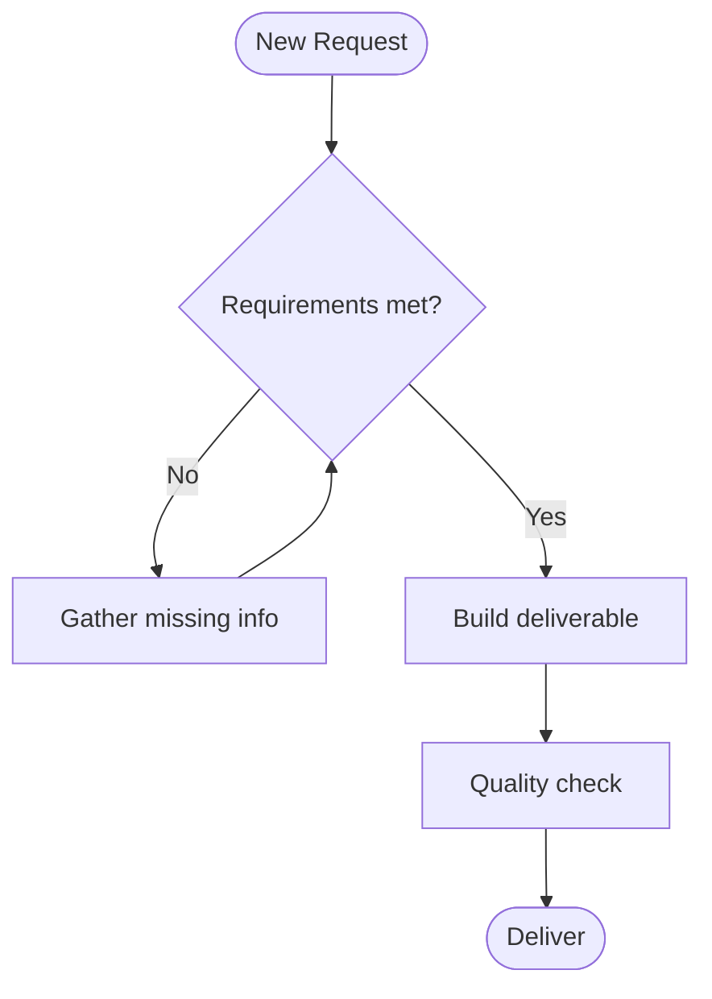
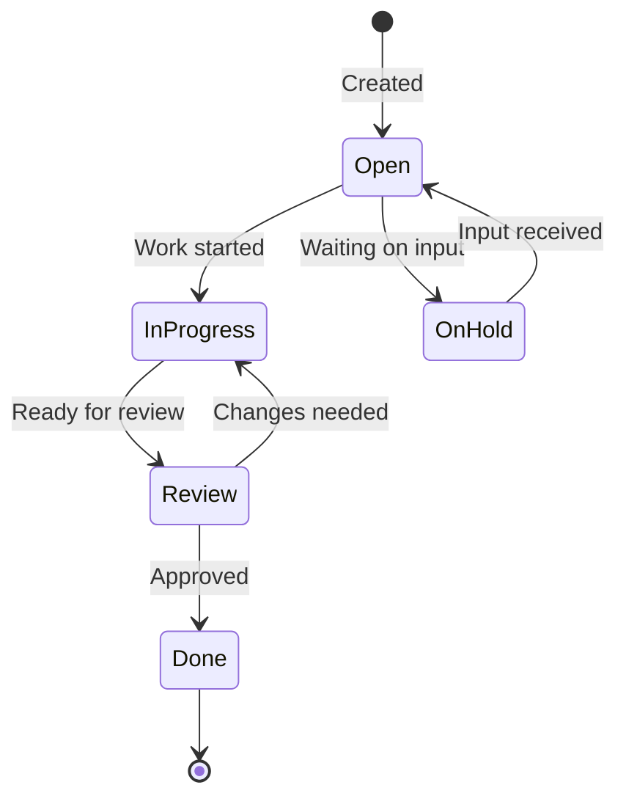
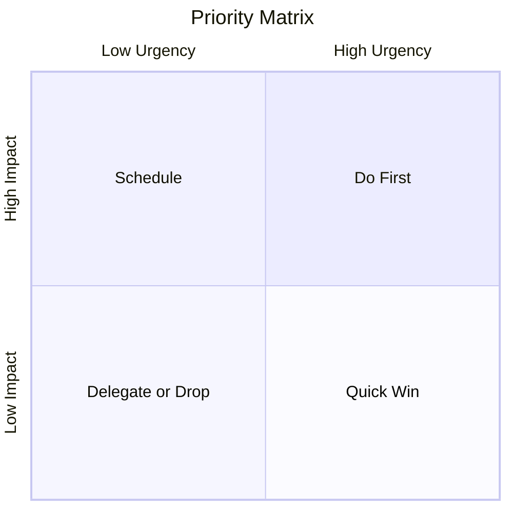

# Best Practices — Documentation Creation
**[YOUR NAME] | [YOUR TITLE] | [YOUR COMPANY]**
*Reference file for all documentation, context files, and deliverables*
*Last Updated: [DATE]*

---

> **How to use this file**: Every context file and AI workflow that produces documentation, diagrams, or deliverables must read this file first. It consolidates rules from across the context library into one place. Where a specific context file has more detail, this file links to it.

---

## 1. Output Format Rules

**Default formats by deliverable type:**

| Deliverable | Format | Never Use |
|-------------|--------|-----------|
| Proposals | `.docx` | PPTX, PDF, HTML, MD |
| Reports, reviews, analyses | `.docx` | MD |
| Executive presentations, board decks | `.pptx` | MD |
| Context files (for AI agent use) | `.md` | DOCX, PPTX |
| Diagrams embedded in deliverables | Rendered image (PNG/SVG from Mermaid) | Raw code blocks in final docs |

**Internal work (you + AI working together):** Use inline responses, `.md`, or plain text. No need for `.docx` or `.pptx`. Keep it fast.

**External deliverables (shared with clients, staff, board, or anyone outside your context):** Use `.docx` or `.pptx`. When in doubt between the two, default to `.docx`.

**When the audience isn't clear, ask:** "Is this for us to work from, or something you'll share outside our context?"

### File Naming Convention

<!--
  CUSTOMIZE: Define your naming pattern. Examples:
  [YYYYMMDD]-[ReportType]-[Descriptor].docx
  [Company] - [Client Name] - Proposal - [YYYY-MM] - v[N].docx
-->

### Folder and Naming Rules (Master Table)

<!--
  CUSTOMIZE: Define your folder structure. Every deliverable type should have
  a defined home so files don't scatter. Example:

  | Report Type | Folder | File Name Format |
  |-------------|--------|-----------------||
  | Pipeline Reviews | `ClaudeCowork/Pipeline Reviews/` | `YYYYMMDD-Pipeline-Review.docx` |
  | Proposals | `Customers/[ClientName]/Proposals/` | `[Company] - [Client] - Proposal - [YYYY-MM] - v[N].docx` |
  | Context / AI config | `ClaudeCowork/Claude Context/` | Descriptive kebab-case `.md` |
  | Memory / glossary | `ClaudeCowork/memory/` | `glossary.md` |

  Always create the folder path if it doesn't exist before saving the file.
-->

---

## 2. Writing Style Rules

**Read `banned-writing-styles.md` before writing anything.** It is the single source for all vocabulary bans, phrase bans, and structural rules. No summary here can stay current with the full file, so don't rely on summaries. Read the source.

---

## 3. Mermaid Diagram Standards

Mermaid diagrams are text-based and render to SVG. They're used to visualize workflows, processes, and relationships. When embedding in `.docx` or `.pptx`, render to PNG first and insert as an image — never paste raw Mermaid code into a Word or PowerPoint file.

### 3.1 — When to Use Each Diagram Type

| Diagram Type | Best For | Example Use Cases |
|---|---|---|
| `flowchart` | Decision logic, process steps, conditional paths | Qualification flow, approval gates, API auth workflow |
| `sequenceDiagram` | System-to-system or person-to-system interactions | API call chains, support ticket lifecycle |
| `stateDiagram-v2` | States and transitions | Deal stage progression, ticket status |
| `gantt` | Project timelines, multi-phase plans | Implementation schedule, project cadence |
| `pie` | Proportional data | Pipeline by stage, category distribution |
| `quadrantChart` | Priority matrix, 2×2 analysis | Deal prioritization, risk vs. opportunity |
| `xychart-beta` | Bar/line data comparison | Trend over time, monthly volume |
| `timeline` | Chronological events | Account history, onboarding sequence |
| `erDiagram` | Data relationships | CRM data model, object relationships |
| `mindmap` | Hierarchical planning | Hypothesis mapping, document outline |

### 3.2 — Example Diagrams

#### Decision Flow Example


#### State Machine Example


#### Priority Quadrant Example


### 3.3 — Rendering Mermaid to Image

To embed Mermaid in a `.docx` or `.pptx`, render it first:

```bash
# Install CLI (once)
npm install -g @mermaid-js/mermaid-cli

# Render to PNG
mmdc -i diagram.mmd -o diagram.png -w 1200 -H 800

# Render to SVG
mmdc -i diagram.mmd -o diagram.svg
```

For `.docx` insertion via python-docx, insert as an inline image:
```python
from docx.shared import Inches
doc.add_picture('diagram.png', width=Inches(6.0))
```

---

## 4. Document Quality Checklist

Before marking any documentation task complete:

- [ ] Output format is correct (`.docx` for deliverables, `.md` for context only)
- [ ] File saved to the correct subfolder with the correct naming convention
- [ ] No banned vocabulary or phrases from `banned-writing-styles.md`
- [ ] No hollow openers, no rule-of-three reflexes, no uniform sentence lengths
- [ ] All diagrams rendered to PNG/SVG before embedding — not raw Mermaid code
- [ ] All credentials loaded from your secret store, never hardcoded
- [ ] Forward-looking close — not a restatement of what was just written

<!--
  ADD YOUR OWN CHECKLIST ITEMS HERE. Examples:
  - [ ] Pricing pulled live from [your CRM] API (for proposals)
  - [ ] Qualification framework fully confirmed before any proposal is drafted
  - [ ] Compliance sections present if required for client type
-->

---

*Read this file at the start of any documentation task. For domain-specific depth, follow the links to the relevant context files.*
*Last updated: [DATE]*
